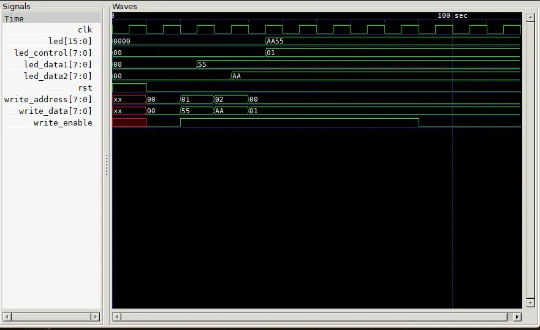

# LED Peripheral - Memory-Mapped I/O Controller

Memory-mapped peripheral for controlling 16 LEDs on the Basys3 FPGA board using three addressable registers.

### Register Map

| Address | Register Name | Description | Bits |
|---------|--------------|-------------|------|
| `0x00` | `led_control` | LED Enable Control | `[0]`: 0=Disable, 1=Enable LEDs |
| `0x01` | `led_data1` | Lower 8 LEDs data | `[7:0]`: LED[7:0] pattern |
| `0x02` | `led_data2` | Upper 8 LEDs data | `[7:0]`: LED[15:8] pattern |

### Register Descriptions

#### Control Register (0x00)
- **Bit 0**: LED Enable (0 = All LEDs OFF, 1 = LEDs display data)
- **Bits 7:1**: Reserved (unused)

#### Data Register 1 (0x01)
- Controls LEDs 0-7 (lower byte)
- Each bit corresponds to one LED

#### Data Register 2 (0x02)
- Controls LEDs 8-15 (upper byte)
- Each bit corresponds to one LED

## Hardware Connections (Basys3)

### Inputs
- **Clock**: W5 (100 MHz system clock)
- **Reset**: U18 (Button Center)
- **Write Enable**: T18 (Button Up)
- **Write Data[7:0]**: V17, V16, W16, W17, W15, V15, W14, W13 (Switches 0-7)
- **Write Address[7:0]**: V2, T3, T2, R3, W2, U1, T1, R2 (Switches 8-15)

### Outputs
- **LED[15:0]**: All 16 onboard LEDs (U16, E19, U19, V19, W18, U15, U14, V14, V13, V3, W3, U3, P3, N3, P1, L1)

## Simulation

The testbench (`led_peripheral_tb.v`) verifies peripheral functionality. Simulate using Icarus Verilog and view waveforms with GTKWave.

### Simulation Waveform

The simulation demonstrates:
- **Reset Phase**: All registers initialize to 0
- **Write Operations**: 
  - `led_data1` ← 0x55 (address 0x01)
  - `led_data2` ← 0xAA (address 0x02)  
  - `led_control` ← 0x01 (address 0x00) - Enable LEDs
- **LED Output**: Shows 0xAA55 when enabled, 0x0000 when disabled

## Implementation on Basys3

1. **Create Vivado Project** targeting Basys3 (xc7a35tcpg236-1)
2. **Add Files**: `led_peripherals.v` (design) and `constraints.xdc`
3. **Run Synthesis** → **Implementation** → **Generate Bitstream**
4. **Program FPGA**: Connect Basys3 via USB and upload `.bit` file

### On-Board Operation

1. Use switches 8-15 to set register address (0x00, 0x01, or 0x02)
2. Use switches 0-7 to set data value
3. Press Button Up to write the data
4. LEDs display the pattern when control register bit 0 is set
